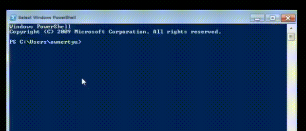
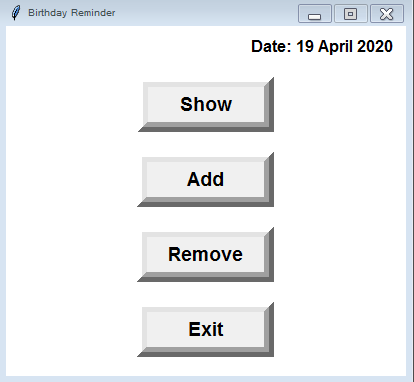
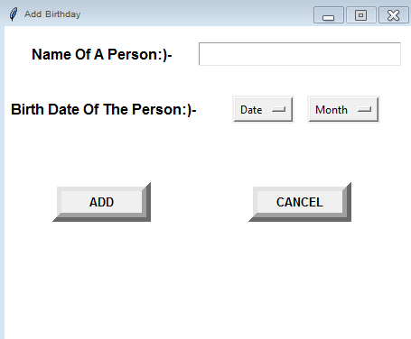
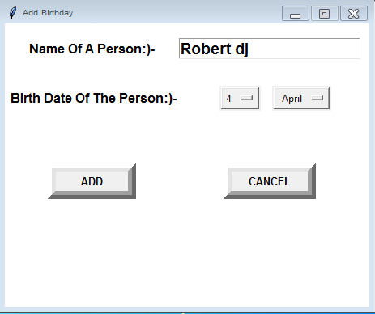
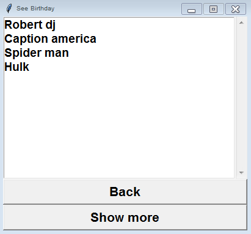
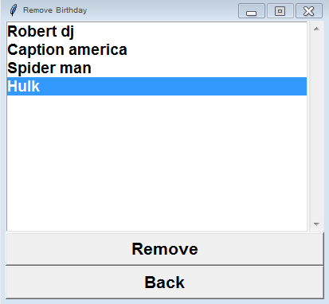
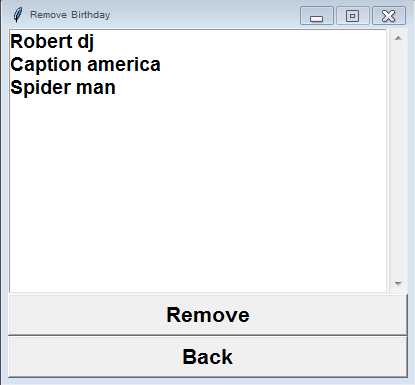

# Birthday_Reminder

Simple Application That Saves The Birthday's of Your Friends & Relatives.
And Notify You On Their Birthdays

## Summary

- [_**Getting Started**_](#getting-started)
- [_**Installation of Prerequisites**_](#prerequisites)
- [_**How To Set Notifier**_](#how-to-set-notifier)
- [_**How To Set Notifier In Windows**_](#how-to-set-notifier-in-windows)
- [_**How to use**_](#how-to-use)


## Getting Started

- Clone The Repository

 ````
Clone : https://github.com/jethliya-balaji/Birthday-Reminder-v.2.git
 ````
---

- Download ZIP File
  - After Download Extract File.  
    - Now You Have Birthday_Reminder_GUI-master

 ````
Download :https://github.com/LokeshLGJ/Birthday_Reminder_GUI/archive/master.zip 
 ````

**Now you have Copy of Project**


## Prerequisites

- First You Go To Terminal/Command Prompt/Powershell  And Type The Following Command As Shown in Video
- If There Is Error Like ``ModuleNotFoundError`` Then Go For Installation



1. _**Python 3**_  
1. _**Python module Plyer**_  
1. _**Python module Pickle**_
1. _**Python module Datetime**_

_**If Not There Use The Following:-**_

````python
Python : https://www.python.org/downloads/
Tkinter: pip install tkinter(standard module)
Plyer  : pip install plyer
Pickle : pip install pickle or pip install pickleshare(standard module)
Datetime: pip install datetime(standard module)
````

## How To Set Notifier

- After [Cloning Or Download ZIP File](#getting-started).  
- You Have ``Birthday_Reminder_GUI-master`` Folder
- In The Folder There Is a File Name: ``Birthday_Notifier.py``
- You Need To Add This File ``Birthday_Notifier.py`` to Task Scheduler In Windows
- For Linux And Mac OS search On Internet ``How To Add Python Script To Task Scheduler``

## How To Set Notifier In Windows
- There Are Two Choice 
  1. Import Task
  2. Or Create Task
  
1. Import Task
    - To Import Task
    - First Go To Start Menu & Search ``Task Scheduler``
    - Open ``Task Scheduler`` And Click ``Task Scheduler Library``
    - Now Click On ``Import Task`` A Open Window Pops Up
    - From Open Window Select The ``Birthday Reminder.xml`` Present In Birthday_Reminder_GUI-master And Click ``Open`` Button
    - After Clicking ``Open`` Button  A Create Task Window  Will Pop Up
    - Now In  Create Task Window  Click On Actions  And Then Click On ``Start a program`` 
    - And Click on ``Edit..``  Button  A Edit Action Window  Will Pop Up
    - In  Program/Script : Past The Location Of Python.exe File 
      - To Get The Location Of python.exe Type The Following Command in Your Terminal/Command Prompt/Powershell   ``python -c "import sys; print(sys.executable)"``
    - And In  Start in :  Past The Location Of  Birthday_Notifier.py File
    - Now Click Ok  
    - Now You Have Set Notifier 
    - Video: [How To Set Notifier In Windows / How To Add python Script To Task Scheduler ](https://github.com/LokeshLGJ/Birthday_Reminder_GUI/blob/master/imgs/Birthday_Notifier.mp4?raw=true)
    
    
## How To Use

- Now You Have Copy Of Project
- And All Requirements 
- Now Open Your Terminal
- cd in Birthday_Reminder_GUI Or Birthday_Reminder_GUI-master
- And type ``python Birthday_Reminder_App.py``
- The Following Window Will Pop up :-
---



- Now Click On ``Add`` Button To Add Birthday
- After Clicking on ``Add`` Button The Following Window Will Pop Up :-
---



---



- Fill All Details
- And Click `` ADD `` Button Data Will Be Added Successfully!!
- To See Data You Added Click On ``Cancel`` Button And then Click ``Show`` Button
- The Following Window Will Pop up :-
---



- To See More Click On ``Show more``
- Or To Remove Data/Birthday Go Back By Clicking On ``Back`` Button
- Now Click on ``Remove`` Button
- Now The Following Window Will Pop Up :
---



- Select The Name You Want To Remove
- And Click On ``Remove`` Button
- The Name Will Be Removed 
---



- See The Above Image The Name Hulk is Removed Successfully!!
